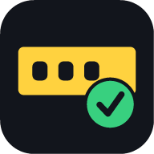

<div align="center">



# TagCheck

**Scan a number plate. Find out if your club already tagged that bike. Only then tag it.**

[](https://github.com/Mistique707/tagcheck/actions/workflows/ci.yml)
[](LICENSE)
[](https://nodejs.org)

</div>

## The problem

You are hanging little cards on parked motorcycles so riders can scan a QR code
and join the club. Ten people are doing it across a city, over weeks. Sooner or
later two of them walk up to the same bike, and a rider finds two cards on the
handlebars — which reads as spam rather than an invitation.

The fix is not more coordination. It is a five-second check on the spot:

> Point the phone at the plate → **already tagged** or **go ahead**.

That is all TagCheck does, and it is built to do it while standing in a car
park with one hand free and one bar of signal.

## What members see

| | |
|---|---|
| 🟢 **Not tagged yet** | Nobody has this bike. The tag button is live. |
| 🔴 **Already tagged** | Who tagged it and when, plus their note. Tagging is blocked. |
| 🟠 **Almost a match** | A plate one character away is already tagged, shown side by side. The member decides. |

There is no app store, no install, no accounts. A member opens a link, types
their name and the club code once, and adds the page to their home screen.
It works on iPhone and Android from the same address.

## Where it runs

The club records have to live somewhere every member's phone can reach, so
there is one decision to make. Both options run the same app.

### Firebase — free, nothing to host *(recommended)*

Google serves the app and holds the records. You run no server and pay nothing;
HTTPS comes included, which matters because **iOS will not give a web page the
camera without it**. Comfortably inside the free tier for a club of 10-15.

**→ [docs/FIREBASE.md](docs/FIREBASE.md)** — about 15 minutes, once.

The duplicate guarantee survives the move: a tag document is keyed by the plate
and the security rules allow `create` but never `update`, so a second person
tagging one bike is refused by Firestore itself. That rule is
[tested against the emulator](test/firestore-rules.spec.mjs), not assumed.

### Self-hosted — a small Node server you control

One process and a SQLite file, on Docker, a VPS, or a spare machine at home.
Choose this if you would rather the data never leave your own box.

**→ [docs/DEPLOY.md](docs/DEPLOY.md)**

```bash
git clone https://github.com/Mistique707/tagcheck.git
```

```bash
cd tagcheck && npm install && npm start
```

The server prints a generated join code on first boot. Open
`http://localhost:3000`, sign in with it, and press **Type it** to try a plate.
Add sample data with `npm run seed`.

For a real drive, set your own codes so they survive restarts:

```bash
cp .env.example .env
```

Edit `CLUB_NAME`, `JOIN_CODE`, `ADMIN_CODE` and `JWT_SECRET`, then run
`node --env-file=.env server/src/index.js`.

---

Either way, onboarding a member is the same: send them the address and the join
code. They type their name once and add the page to their home screen.

## Using it on a drive

1. **Aim** so the plate fills the yellow box, and press **Scan plate**.
2. **Read the answer.** Green means go, red means walk away, amber means look
   closer.
3. **Check the characters** against the metal before you tag. The reading is
   shown in a plate-shaped box for exactly that comparison.
4. **Tag it**, optionally with a note like `red Duke outside the gym`, which is
   what makes a tag findable later.

If the camera cannot read a dirty or angled plate, **Type it** is always there
and is a first-class path, not a fallback. Reading plates off a phone in a car
park is genuinely hard; the app is designed so a failed read costs three
seconds of typing rather than a wasted trip.

## How duplicates are actually prevented

Four layers, because any one of them alone leaks.

**1. One plate, one canonical form.** `shared/plate.js` scrubs spacing,
punctuation and the word `IND`, then parses the standard series
(`MH 12 AB 1234`) and the Bharat series (`23 BH 1234 AB`). Every way of writing
one plate collapses to one string.

**2. Look-alike repair.** Cameras confuse `0/O/D/Q`, `1/I/L`, `2/Z`, `5/S` and
`8/B`. A misread is repaired towards a legal layout — but only towards the
*likeliest* one. `MHI2A8I234` could be read as `MH12AB1234` or `MH1ZAB1234`;
both are legal plates, so candidates are scored on how many characters they
rewrite and on how plates are actually issued (almost all end in a four-digit
number). The common reading wins, and a plate that already parses cleanly is
never rewritten.

**3. Near-match warnings.** When a misread is *itself* a legal plate it cannot
just be rewritten, so both are shown to a human. This is what a shape key is
for: every confusable character collapses to one representative, and a
collision means "look at these two before you tag".

**4. A constraint in the data store.** All of the above is judgement, and
judgement can be wrong under a race. The real guarantee sits below the
application, in whichever store you chose.

Self-hosted, it is a partial unique index:

```sql
CREATE UNIQUE INDEX ux_tags_active_plate ON tags(plate) WHERE removed_at IS NULL;
```

On Firebase, it is a security rule over a document keyed by the plate:

```
allow create: if isMember() && request.resource.data.plate == plateId;
allow update: if false;
```

Either way, two phones tagging the same bike in the same second means one write
lands and the other is refused with the winner's name — and removing a tag
frees the bike to be tagged again.

## Working without signal

Car parks and basements do not have signal, and the answer is worthless if it
does not arrive.

- The app keeps a **mirror of every tagged plate** in IndexedDB, refreshed by a
  delta feed. Lookups fall back to it automatically and say so on screen.
- Tags made offline go into a **queue**, and the bike is marked locally right
  away so the same member cannot double-tag it.
- On reconnect the queue is replayed with an **idempotency key**, so a retry
  lands on the row it already created instead of a second one. If someone else
  tagged that bike meanwhile, the conflict resolves to their tag.

## Configuration

Every setting is an environment variable; see [.env.example](.env.example).

| Variable | Default | What it does |
|---|---|---|
| `CLUB_NAME` | `TagCheck` | Shown at the top of the app |
| `JOIN_CODE` | generated | The code members type once to join |
| `ADMIN_CODE` | generated | Also grants removing any tag and CSV export |
| `JWT_SECRET` | generated | Signs member tokens; set it or restarts sign everyone out |
| `DB_FILE` | `data/tagcheck.db` | SQLite file; put it on a volume in production |
| `PORT` / `HOST` | `3000` / `0.0.0.0` | Where to listen |
| `JOIN_URL` | – | The link your paper signs point at |
| `CORS_ORIGIN` | – | Needed only when the app is hosted apart from the server |
| `UNDO_WINDOW_MS` | `86400000` | How long a member may undo their own tag |
| `TRUST_PROXY` | – | Set to `1` behind a proxy so rate limits see real addresses |

Anything left unset that must not be guessable is generated at boot and printed
once, so a fresh deployment is never quietly insecure.

## API

All routes except `/api/health`, `/api/club` and `/api/session` need
`Authorization: Bearer <token>`.

| Method | Route | Purpose |
|---|---|---|
| `GET` | `/api/health` | Liveness |
| `GET` | `/api/club` | Club name shown before sign-in |
| `POST` | `/api/session` | Exchange join code + name for a token |
| `GET` | `/api/plates/:plate` | **The check.** `free`, `tagged` or `similar` |
| `POST` | `/api/tags` | Tag a bike. `409` if it is already tagged |
| `GET` | `/api/tags` | Recent tags, `?mine=1`, `?before=<iso>` |
| `DELETE` | `/api/tags/:id` | Undo (own tag, or admin) |
| `GET` | `/api/sync` | Delta feed for the offline mirror, `?since=<iso>` |
| `GET` | `/api/stats` | Totals and leaderboard |
| `GET` | `/api/export.csv` | Full export (admin) |

## Data and privacy

A tag stores the plate, who tagged it, when, an optional note, and — only if a
member switches it on — a coarse location. Plates are vehicle registrations,
not personal profiles, and nothing is looked up against any vehicle registry.
Location is **off by default** and the app never asks for it until a member
turns it on.

The records live in a SQLite file you host, or in your own Firebase project.
Members sign in anonymously: on Firebase nobody supplies an email, a phone
number or a password, and a member record holds only the name they typed.

Recognition runs on the phone. With the default setup the engine itself is
fetched from a public CDN; run `npm run vendor:ocr` to serve it from your own
server instead, which also makes plate reading work fully offline. Plate images
are never uploaded anywhere by either path.

## Development

```bash
npm run dev
```

```bash
npm test
```

37 tests cover the normaliser (canonical forms, look-alike repair, shape keys)
and the API (duplicate blocking, races, offline replay, undo, permissions).

```bash
npm run test:rules
```

25 more run the Firestore security rules against a local emulator — joining,
admin promotion, tag immutability, the undo window, and the duplicate
guarantee. Needs Java installed; CI runs them on every push.

```
shared/plate.js      the normaliser, imported unchanged by server and browser
server/src/          Express + node:sqlite, no ORM
firestore.rules      the entire security model for the serverless setup
web/                 the app: no build step, no framework, native ES modules
web/backend*.js      the two storage backends behind one interface
tools/               icon generator, OCR vendoring, sample data, site assembly
```

There is no bundler. `web/` is what ships, which means a member's phone gets
roughly 80 kB of application code. Which backend runs is decided by whether
`web/firebase-config.js` has a config in it; nothing else in the app changes.

## Known limits

- **Plate reading is assistive, not authoritative.** Dirt, glare, angles,
  novelty fonts and decorative plates all defeat it. The interface assumes this
  and puts a human confirmation between the reading and the tag.
- **The service worker has not been verified on a physical phone** — the
  development browser used here blocks registration outright. Everything else
  in the offline path (mirror, queue, replay) is tested and working. Please
  check home-screen install on a real handset before a large drive.
- **One club per deployment.** There is no multi-tenancy; run a second instance
  or a second Firebase project.
- **Codes are shared secrets.** Anyone with the join code can add tags. That is
  the right trade for a volunteer drive, but rotate the code when it leaks.

## License

[MIT](LICENSE).
